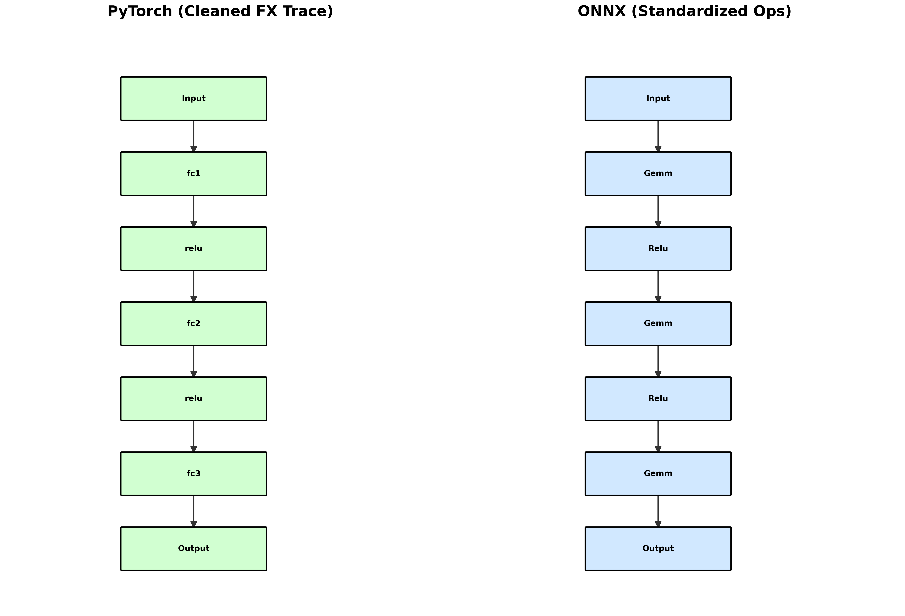
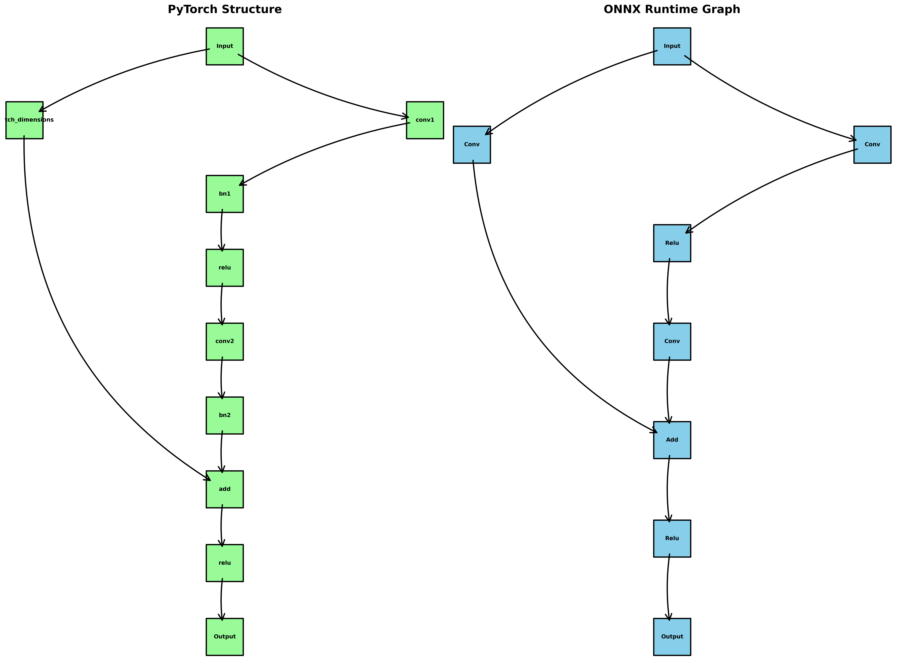

[](https://arxiv.org/abs/2512.16841)
[](https://www.linkedin.com/in/devmuniz)
[](https://github.com/devMuniz02)
[](https://devmuniz02.github.io/)
[](https://huggingface.co/manu02)

# Onnx Conversion

> A curated collection of notebooks and scripts demonstrating the end-to-end pipeline for converting Deep Learning models to ONNX. Features performance benchmarks, graph validation, and cross-framework deployment examples.

- [Features](#features) - [Installation](#installation) - [Repository Setup](#repository-setup) - [Usage](#usage) - [Configuration](#configuration) - [Contributing](#contributing) - [License](#license) - [Contact](#contact)

## Overview

A curated collection of notebooks and scripts demonstrating the end-to-end pipeline for converting Deep Learning models to ONNX. Features performance benchmarks, graph validation, and cross-framework deployment examples.

## Repository Structure

| Path | Description |
| --- | --- |
| `assets/` | Images, figures, or other supporting media used by the project. |
| `notebooks/` | Exploratory notebooks and experiment walkthroughs. |
| `.gitignore` | Top-level file included in the repository. |
| `LICENSE` | Repository license information. |
| `README.md` | Primary project documentation. |
| `requirements.txt` | Python dependency specification for local setup. |

## Getting Started

1. Clone the repository.

   ```bash
   git clone https://github.com/devMuniz02/Onnx-conversion.git
   cd Onnx-conversion
   ```

2. Prepare the local environment.

Install Python dependencies:
```bash
pip install -r requirements.txt
```

3. Run or inspect the project entry point.

Use the project-specific scripts or notebooks in the repository root to run the workflow.

## Features

- **PyTorch to ONNX Conversion**: Convert PyTorch models to ONNX format with ease
- **Model Validation**: Validate exported ONNX models for correctness
- **ONNX Runtime Inference**: Run inference using ONNX Runtime for performance benchmarking
- **Graph Visualization**: Side-by-side comparison of PyTorch and ONNX computational graphs with custom layouts
- **Jupyter Notebooks**: Interactive examples and tutorials for model conversion
- **Cross-Framework Support**: Examples for converting models from various deep learning frameworks

## Installation

### Prerequisites

- Python 3.8+
- Git

### Installation Steps

```bash
# Clone the repository
git clone https://github.com/devMuniz02/Onnx-conversion.git

# Navigate to the project directory
cd Onnx-conversion

# Install dependencies
pip install -r requirements.txt
```

## Usage

### Basic Usage

1. Install dependencies: `pip install -r requirements.txt`
2. Open the Jupyter notebook: `jupyter notebook notebooks/conversion.ipynb`
3. Run the cells to convert a PyTorch model to ONNX and validate it

### Running the Conversion Example

The `notebooks/conversion.ipynb` demonstrates:
- Defining a simple PyTorch neural network (3-layer MLP)
- Exporting it to ONNX format
- Loading and running inference with ONNX Runtime
- Validating model outputs for correctness
- Visualizing and comparing PyTorch vs ONNX computational graphs side-by-side

### Advanced Usage

For more complex models, modify the notebook to:
- Use your own PyTorch model
- Adjust input shapes and dynamic axes
- Add custom preprocessing/postprocessing
- Customize graph visualization layouts and styling

The notebook generates a `model_flow.png` image in the `assets/` folder showcasing the graph comparison.

## License

This project is licensed under the MIT License - see the [LICENSE](LICENSE) file for details.

**Links:**
- **GitHub:** [https://github.com/devMuniz02/](https://github.com/devMuniz02/)
- **LinkedIn:** [https://www.linkedin.com/in/devmuniz](https://www.linkedin.com/in/devmuniz)
- **Hugging Face:** [https://huggingface.co/manu02](https://huggingface.co/manu02)
- **Portfolio:** [https://devmuniz02.github.io/](https://devmuniz02.github.io/)

Project Link: [https://github.com/devMuniz02/Onnx-conversion](https://github.com/devMuniz02/Onnx-conversion)

---

⭐ If you find this project helpful, please give it a star!

## Table of Contents

- [Features](#features)
- [Installation](#installation)
- [Repository Setup](#repository-setup)
- [Usage](#usage)
- [Configuration](#configuration)
- [Contributing](#contributing)
- [License](#license)
- [Contact](#contact)

## Project Structure

```
Onnx-conversion/
├── assets/                 # Static assets (images, icons, etc.)
├── data/                   # Data files and datasets
├── docs/                   # Documentation files
├── notebooks/              # Jupyter notebooks for conversion examples
│   └── conversion.ipynb    # PyTorch to ONNX conversion demo
├── scripts/                # Utility scripts and automation tools
├── src/                    # Source code
├── tests/                  # Unit tests and test files
├── model.onnx              # Exported ONNX model example
├── LICENSE                 # License file
├── README.md               # Project documentation
└── requirements.txt        # Python dependencies
```

### Directory Descriptions

- **`assets/`**: Store static files like images, icons, fonts, and other media assets.
- **`data/`**: Place datasets, input files, and any data-related resources here.
- **`docs/`**: Additional documentation, guides, and project-related files.
- **`notebooks/`**: Jupyter notebooks for data exploration, prototyping, and demonstrations.
- **`scripts/`**: Utility scripts for automation, setup, deployment, or maintenance tasks.
- **`src/`**: Main source code for the project.
- **`tests/`**: Unit tests, integration tests, and test-related files.

## Visualization Examples

Here are examples of the computational graph visualizations generated by the notebook:

### Simple MLP Model Comparison


### Complex Residual CNN Model Comparison


## ️ Configuration

- **ONNX Opset Version**: The notebook uses opset version 11, which is widely supported
- **Dynamic Axes**: Configured for variable batch sizes
- **ONNX Runtime**: Supports both CPU and GPU execution (if CUDA is available)
- **Graph Visualization**: Custom matplotlib-based plotting with per-label text box sizing for optimal fit
